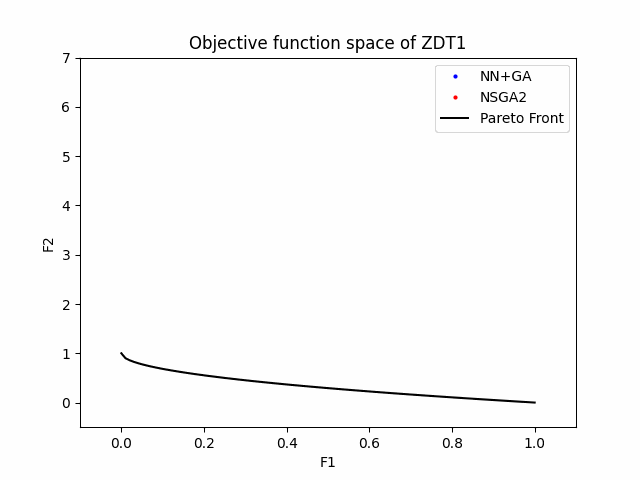

# NN+GA (v2.0): the SBO framework via neural network and genetic algorithm 

Nature-inspired stochastic search techniques such as Evolutionary Algorithms (EAs) are known for their ability to solve complex optimization problems. However, they typically require numerous function evaluations in their search process to find global optimums. This is a drawback if we use EAs in optimization problems with computationally expensive functions. Therefore, surrogate models have been used as cheap approximations to replace these functions. In this project, we propose a dynamically retrained Neural Network (NN)-based surrogate model coupled with a genetic algorithm (GA), NSGA-II, to reduce the number of function evaluations in the optimization process. We have successfully applied the proposed method to some test functions and real-world aerodynamic shape optimization problems. It is also shown that it converges more quickly towards the Pareto-optimal front with fewer function evaluations than a stand-alone NSGA-II in all optimization problems. This repository contains applications of the framework to some test functions.

Please cite the following paper if you use this code:

Hariansyah, M. A., and Shimoyama, K., "On the Use of a Multilayer Perceptron Based Surrogate Model in Evolutionary Optimization", Proceedings of the Computational Mechanics Conference, 2021,
Vol. 2021.34, Online ISSN 2424-2799.
https://doi.org/10.1299/jsmecmd.2021.34.235
[[ResearchGate]](https://www.researchgate.net/publication/363653550_On_the_use_of_a_multilayer_perceptron_based_surrogate_model_in_evolutionary_optimization)

## Requirements

This code depends on and has been tested in the following environments:
- `Python 3.9.6`
- `numpy-1.23.4`
- `scipy-1.9.2`
- `matplotlib-3.6.1`
- `pymoo-0.6.0`
- `torch-1.12.1`

## Routines

0. Read `Readme.txt`
1. Edit the config file `config.dat`
      * if you want to use NN+GA, set line 69 to `USE_NN = TRUE`
      * if you want to use PURE_GA, set line 69 to `USE_NN = FALSE`
      * edit and fine-tune other variables as well, see `TestedConditions.txt`
2. Edit the class `NeuralNet` in the file `nnga/NeuralNet.py` to build
   the neural net structure depending on the problem (trial-and-error)
   by default: 3 hidden layers with two layers sharing the same weights
3. Execute `python main.py`
4. Execute `python plot.py`
5. Execute `python animate.py`
6. See the output files in the `OUTPUT` folder
7. See the GIF animation in the `PLOT` folder

## Results

  

## Contact

The original code was developed by Koji Shimoyama and Taiga Kato and was written in C. This code is adapted with new features and techniques such as configurability using `config.dat`, clustering techniques using `kmeans.py`, data processing in `DataProcess.py`, plotting animation in `animate.py`, and the latest deep learning library using PyTorch in `NeuralNet.py`. This code was fully written in Python and is maintained by Alfiyandy Hariansyah.

email: muhammad.alfiyandy.hariansyah.s8 (at) dc (dot) tohoku (dot) ac (dot) jp
